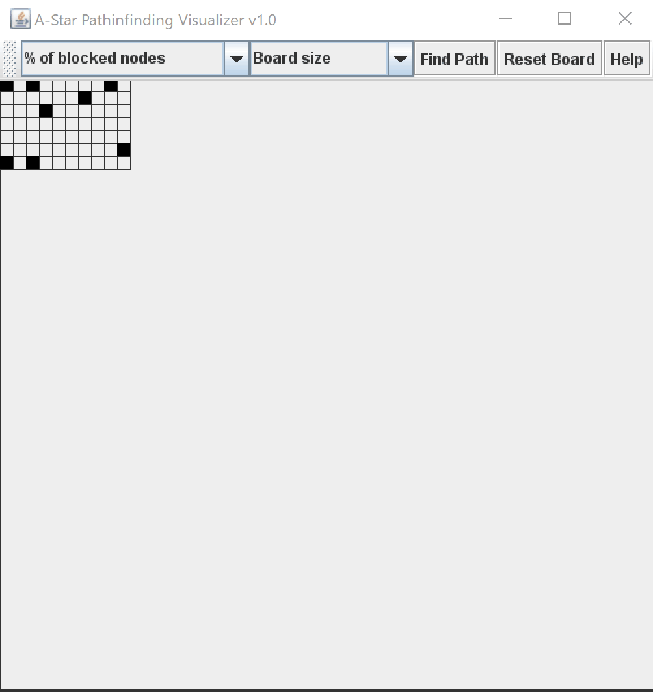

# Pathfinding Visualizer V1.0 by Mason Herron
This project is a pathfinding visualization tool that utilizes java swing components for UI as well as the A-star method for pathfinding.

The user can choose the size of the board, the blocked node percentage, as well as setting the start and finish points. Upon clicking on "find path" the A-star method is used to calculate the shortest path between two nodes. The cyan squares are "explored nodes" and the yellow nodes show the path. 

Below is a quick demonstration:

